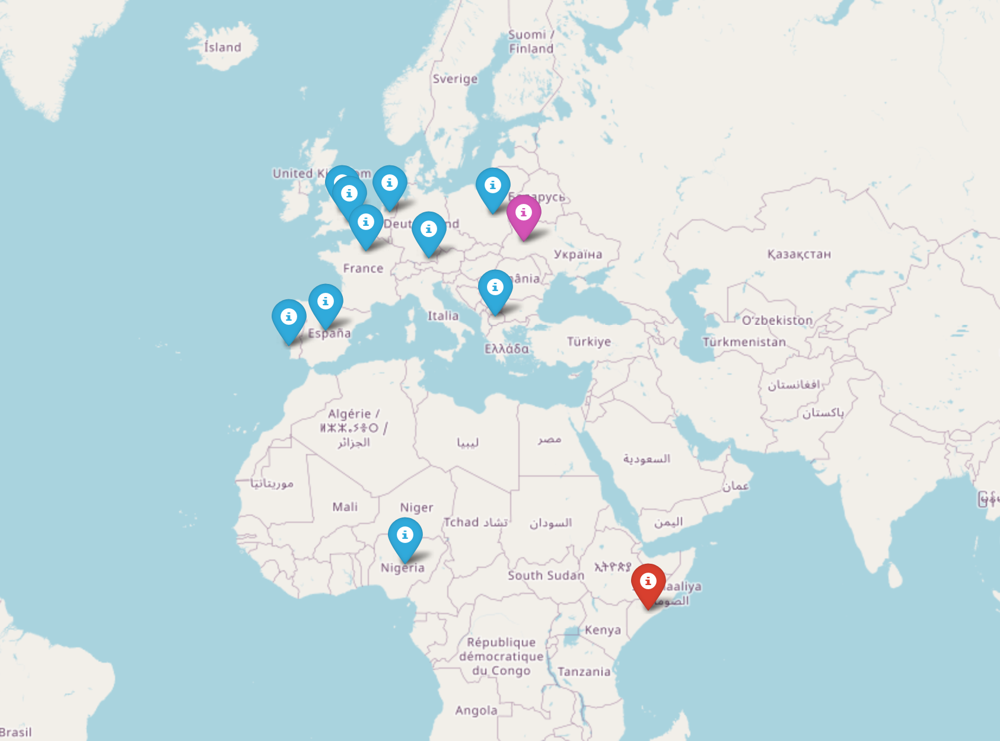

Functions:

inputed() - Returns inputed by user information about year and coordinates

read_file(my_file, year) - Reads file and return a dictionary of films, produced in current year

get_coordinates(address) - Returns coordinates of given address

find_closest_coordinates(latitude, longitude, year) - Returns information about 10 closest to user points

map(list_of_films, latitude, longitude, year) - Creates a map with markers on film places, user's location and the best city

main() - Unites all functions and starts the work of module

Example of result:

 
  
